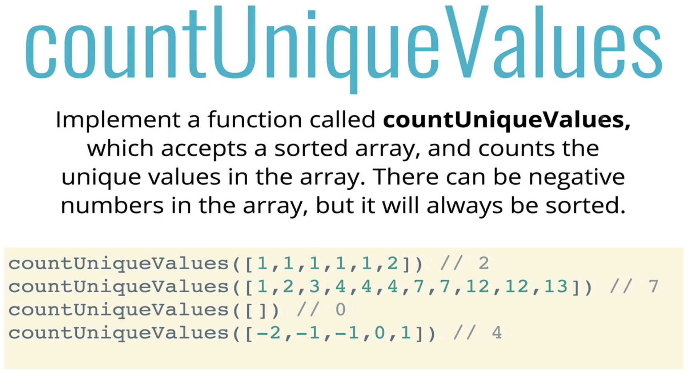

# Problem Solving Approach

## What is an algorithm?

> A process or set of steps to accomplish a certain task.

## How do you improve?

1. Devise a plan for solving problems
2. Master common problem solving patterns

## Problem Solving Mantra

1. Understand the Problem
1. Explore Concrete Examples
1. Break It Down
1. Solve/Simplify
1. Look Back and Refactor

### Understand the Problem

Ask yourself/interviewer these questions to better understand the problem

1. Can I restate the problem in my own words?
2. What are the inputs that go into the problem?
3. What are the outputs that should come from the solution to the problem?
4. Can the outputs be determined from the inputs? In other words, do I have enough information to solve the problem? (You may not be able to answer this question until you set about solving the problem. That's okay; it's still worth considering the question at this early stage.)
5. How should I label the important pieces of data that are a part of the problem?

### Explore Concrete Examples

**Why do it?**

1. Coming up with examples can help you understand the problem better
1. Examples also provide sanity checks that your eventual solution works how it should

**How to do it?**

1. Start with Simple Examples
1. Progress to More Complex Examples
1. Explore Examples with Empty Inputs
1. Explore Examples with Invalid Inputs

### Break it Down

> Explicitly write out the steps you need to take.

This forces you to think about the code you'll write before you write it, and helps you catch any lingering conceptual issues or misunderstandings before you dive in and have to worry about details (e.g. language syntax).

Here is an example where you are required to calculate the count for each character in a string

```javascript
function charCount(str){
    // make object to return at end
    // loop over string, for each character...
        //if the char is a number/letter AND is a key in object, add one to count
        //if the char is a number/letter AND not in object, add it to object and set value to 1
        //if character is something else (space, period, etc.) don't do anything
    // return object at end
```

:boom: This method will also be handy in cases where you are unable to complete the code in an interview. Since, your code contains comments for the next steps; this will atleast let the interviewer know what your overall thinking was. And in the process you also end up adding helpful comments to your code.

### Solve/Simplify

> SOLVE THE PROBLEM If you can't... SOLVE A SIMPLER PROBLEM!

Instead of focusing on that one difficult part of the problem, trying working on a part of the problem which you know how to solve.

#### The Simplify Mantra

1. Find the core difficulty in what you're trying to do
1. Temporarily ignore that difficulty
1. Write a simplified solution
1. Then incorporate that difficulty back in

For example, let us say that you are unable to write a logic with a loop. Then according to the mantra mentioned above, you can trying writing the logic without the loop. You can work on the logic involved in the individual loop steps and when you find a pattern, you can incorporate this solution in a loop.

### Look Back and Refactor

1. Can you check the result?
1. Can you derive the result differently?
1. Can you understand it at a glance?
1. Can you use the result or method for some other problem?
1. Can you improve the performance of your solution?
1. Can you think of other ways to refactor?
1. How have other people solved this problem?

A refactored version for the `count char in a string` problem can be found below -

```javascript
function charCount (str) {
    var obj {};
    for (var char of str) {
        char = char. toLowerCase();
        if (/[a-z0-9]/.test(char)) {
           obj[char] = ++obj[char] || 1;
        }
    }
    return obj;
```

:warning: The following line `obj[char] = ++obj[char] || 1;` increases the count if a character exists in the object else it assigns the object with value 1.

Also, in some cases regex might not be the fastest solution, so we can further improve the above code -

```javascript
function charCount(str) {
  var obj = {};
  for (var char of str) {
    if (isAlphaNumeric(char)) {
      char = char.toLowerCase();
      obj[char] = ++obj[char] || 1;
    }
  }
  return obj;
}

function isAlphaNumeric(char) {
  var code = char.charCodeAt(0);
  if (
    !(code > 47 && code < 58) && // numeric (0-9)
    !(code > 64 && code < 91) && // upper alpha (A-Z)
    !(code > 96 && code < 123)
  ) {
    // lower alpha (a-z)
    return false;
  }
  return true;
}
```

We have improved the code by adding a separate function that checks if a character is alpha-numeric or not. The `isAlphaNumeric()` function further does not use regex which improves its speed and performance.

This is how we can improve and refactor our existing code.

# Problem Solving Patterns

## Some Common Patterns

1. Frequency Counter
1. Multiple Pointers
1. Sliding Window
1. Divide and Conquer
1. Dynamic Programming
1. Greedy Algorithms
1. Backtracking
1. ...Many more!

## FREQUENCY COUNTERS

This pattern uses objects or sets to collect values/frequencies of values. This pattern has O(N) time complexity.

This can often avoid the need for nested loops or O(N^2) operations with arrays / strings.

### Problem #1

Here is a problem based on this pattern -

<p align="center"></p>

And here is a naive solution for the same -

<p align="center"></p>

The refactored solution which makes use of the frequence pattern can be found below -

<p align="center"></p>

### Problem #2

Another problem based on the frequency counter pattern -

<p align="center"></p>

The solution for the above problem can be found below -

```javascript
function getCharacterFrequencyObject(inputString) {
  let frequencyObject = {};
  for (let character of inputString) {
    frequencyObject[character] = (frequencyObject[character] || 0) + 1;
  }
  return frequencyObject;
}

function validAnagram(stringOne, stringTwo) {
  // 1. two strings should of the same length
  if (stringOne.length !== stringTwo.length) {
    return false;
  }
  // 2. character frequency array for both the strings
  // should be the same
  let stringOneCharacterFrequency = getCharacterFrequencyObject(stringOne);
  let stringTwoCharacterFrequency = getCharacterFrequencyObject(stringTwo);

  for (let key in stringTwoCharacterFrequency) {
    // check if a character in stringOne is present in StringTwo
    if (!(key in stringOneCharacterFrequency)) {
      return false;
    }

    // check if the frequency of the both the characters are same
    if (stringOneCharacterFrequency[key] !== stringTwoCharacterFrequency[key]) {
      return false;
    }
  }
  return true;
}
```

Another elegant solution for this problem can be found below -

```javascript
function validAnagram(stringOne, stringTwo) {
  // 1. two strings should of the same length
  if (stringOne.length !== stringTwo.length) {
    return false;
  }
  // 2. create a lookup table for one array
  let lookup = {};
  for (let character of stringOne) {
    lookup[character] = (lookup[character] || 0) + 1;
  }

  // check if all the characters of stringTwo
  // exists in lookup table
  for (let character of stringTwo) {
    if (!lookup[character]) {
      // return false if a character from stringTwo
      // does not exist in the lookup
      return false;
    } else {
      // if the character exists in stringTwo, strike off that character
      // by reducing its count by one
      // Striking off a character ensures that we don't count the character twice
      lookup[character] -= 1;
    }
  }
  return true;
}

validAnagram("anagram", "nagaram");
```

## MULTIPLE POINTERS

> Creating pointers or values that correspond to an index or position and move towards the beginning, end or middle based on a certain condition.

Very efficient for solving problems with minimal space complexity as well.

The idea here is to create pointers (e.g. 2 pointers) that move through an iterable based on certain conditions.

### Problem #1

Here is a problem based on this pattern -

<p align="center"></p>

:warning: Please not that the array mentioned in the problem above is **sorted**. If the array mentioned in the above problem was unsorted; multiple pointers approach would not have worked.

A naive solution for the above problem without using the multiple pointers pattern can be found below -

<p align="center"></p>

A solution that makes use of the multiple pointers approach is shown below -

<p align="center"></p>

In the above code, we make use of two pointers, one starting from the extreme left and the other starting at the extreme right.

These two pointers point to the extreme end values of the given ordered array.

Since, this is an ordered array; if we move from left to right, the interger values will in increase whereas of we move from right to left, the value will decrease.

In order to find the pair who sum is 0, we do the following -

1. Take two pointers from both the extremes (left and right)
1. Calculate the sum of the two extreme pointers.

Depending on the result of the sum, we move the pointers.

If the sum of the pointers is > 0, this would imply that we need slightly smaller value on the right-side pointer.

If the sum of the pointers is < 0; this would imply that the we need a slightly larger value on the left-side pointer.

Let us take the input array as `[-4, -3, -2, -1, 0, 1, 2, 5]` and follow the algorithm -

Initially,

```
rightPointer = 5
leftPointer = -4
```

1. Sum of `-4 + 5 = 1`, and this is greater than 0. So we move the rightPointer to the left.

```
rightPointer = 2
leftPointer = -4
```

2. Sum of `2 - 4 = -2`, and this is less than 0. So we now have to move the leftPointer to the right.

```
rightPointer = 2
leftPointer = -3
```

3. Sum of `2 - 3 = -1`, and this is again less than 0. So we have to move the leftPointer to the right again.

```
rightPointer = 2
leftPointer = -2
```

4. Sum of `2 - 2 = 0`, and now the sum is equal to zero. We can return the pair.

### Problem #2

Here is another problem based on this pattern -

<p align="center"></p>

Here is my solution -

```javascript
function countUniqueValues(inputArray) {
  let lookup = {};
  for (let element of inputArray) {
    lookup[element] = (lookup[element] || 0) + 1;
  }
  return Object.keys(lookup).length;
}
```

Another solution that uses two pointers is shown below -

```javascript
function countUniqueValues(inputArray) {
  if (inputArray.length === 0) {
    return 0;
  }

  let i = 0;
  for (let j = 1; j < inputArray.length; j++) {
    if (inputArray[i] !== inputArray[j]) {
      i++;
      inputArray[i] = inputArray[j];
    }
  }

  return i + 1;
}
```

In the above code, we make use of two pointers `i` and `j` which initially point to `0` and `1` index respectively. As the loop pregresses `j` increases. 

But the value of `i` only increases when the value at the `i` and `j` index differs. When this happens, the value of `i` is incremented and the value at the `j` index is assigned to the `i` index value. 

This process modifies the existing array in such a way that all values before the `i` index contains unique values. Therefore to get the unique count, we can return `i + 1` at the end of the for-loop.

## SLIDING WINDOW

> This pattern involves creating a window which can either be an array or number from one position to another. Depending on a certain condition, the window either increases or closes (and a new window is created) 

:warning: Very useful for keeping track of a subset of data in an array/string etc.
